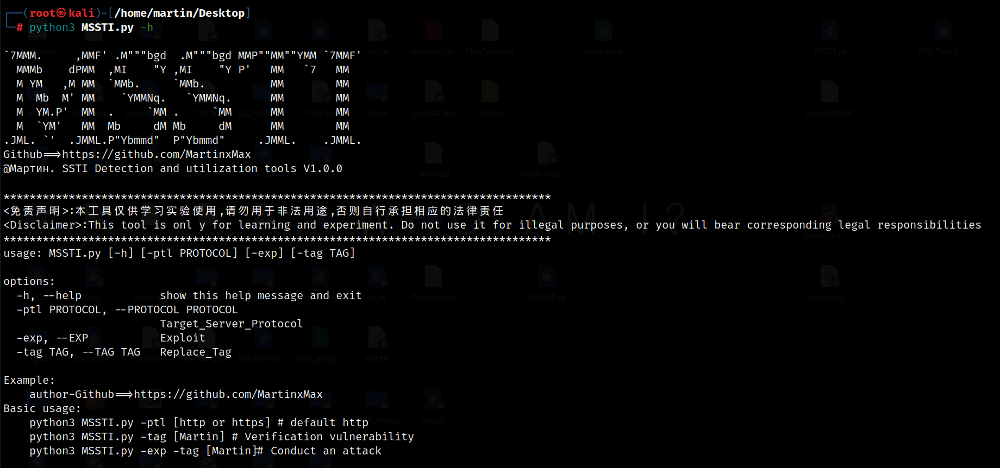
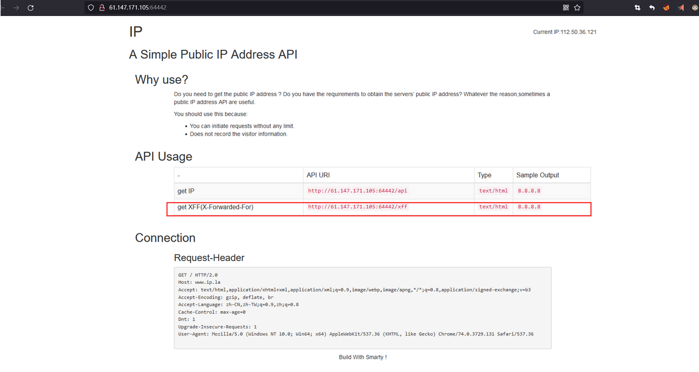
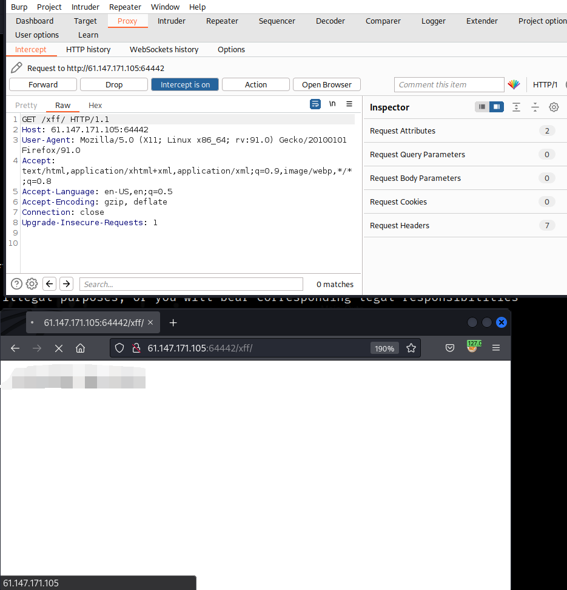
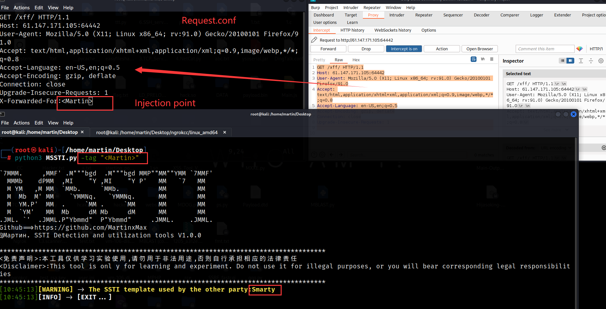
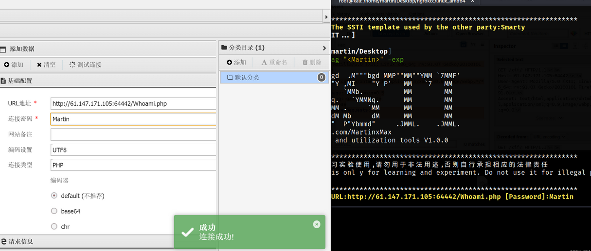

<div align="center">
    <p align="center">
    
    
    
    
    
    </p>
    
    <table>
        <tr>
            <th>Function</th>
        </tr>
        <tr>
            <th>Verification vulnerability</th>
        </tr>
        <tr>
            <th>Get Webshell</th>
        </tr>
    </table>
</div>

## usage method
  * View help information

      ```#python3 MSSTI.py -h```

    

# Vulnerability exploitation

_Web_
    

    

_Verify SSTI vulnerability_


 ```#python3 MSSTI.py -tag "<Martin>"```


    
  

_Attack_


 ```#python3 MSSTI.py -tag "<Martin>" -exp```

     
  
